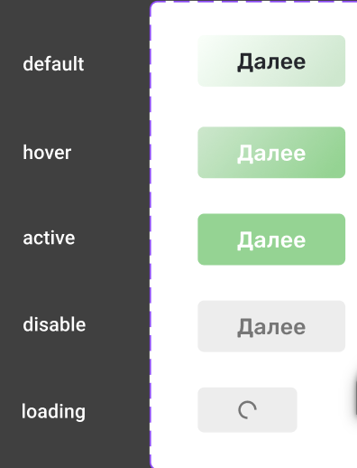

# Тестовое задание: SPA приложение на Vue 3

**[English version below](#in-english)**

Этот проект является демонстрацией выполнения тестового задания на создание SPA приложения с использованием Vue 3, Vue Router и Pinia. Приложение взаимодействует с API и включает в себя несколько экранов с функциональностью, описанной ниже.

---

## Описание задачи

Если в условиях не хватает каких-то данных, то опирайтесь на здравый смысл.

### Требования к стеку:
- **Vue 3**
- **Vue Router**
- **Pinia**

### Компоненты:
1. **Инпут** (Input)
2. **Кнопка** (Button)
3. **Интерфейс перехода между экранами** (Navigation Tabs)
4. **Таблица данных** (Data Table)

### Стилистика:

#### Кнопки и инпуты



### Интерфейс перехода между экранами


### Таблица данных


---

### Функционал

#### Экран «Форма»:
- Четыре инпута:
  - ФИО
  - Дата рождения
  - Номер телефона
  - Электронная почта
- Инпуты настроены на валидацию в соответствии с их типом.
- Кнопка «Отправить» активна только в случае, если все инпуты заполнены и валидны.
- При клике на кнопку «Отправить»:
  - Инпуты очищаются.
  - Введенные данные сохраняются в хранилище.

#### Экран «Данные»:
- Таблица, которая отображает данные, введенные на экране «Форма».
- Данные должны сохраняться при перезагрузке страницы.

---

## Установка и запуск проекта

1. Клонируйте репозиторий:
   ```sh
   git clone https://github.com/palaum/territory-test.git
   ```
2. Перейдите в папку проекта:
   ```sh
   cd territory-test
   ```
3. Установите зависимости:
   ```sh
   npm install
   ```
4. Запустите проект в режиме разработки:
   ```sh
   npm run dev
   ```
5. Для сборки проекта выполните команду:
   ```sh
   npm run build
   ```
   Собранные файлы будут находиться в папке dist.

## Уточнение по API

**/src/api/index.js**

- Для моковых данных использовался сервис [mockapi.io](https://mockapi.io/)
- Для перехода на локальные моковые данные активируйте флаг **useMockData = true**


## Связаться

Если у вас есть вопросы или предложения, вы можете связаться со мной:

- **Telegram**: [@palaum](https://t.me/palaum)

---

<a id="in-english"></a>

## English version

# Test Task: SPA Application on Vue 3

This project is a demonstration of completing a test task to create an SPA application using Vue 3, Vue Router, and Pinia. The application interacts with an API and includes several screens with the functionality described below.

---

## Task Description

If any data is missing in the conditions, rely on common sense.

### Tech Stack Requirements:
- **Vue 3**
- **Vue Router**
- **Pinia**

### Components:
1. **Input**
2. **Button**
3. **Navigation Interface** (Navigation Tabs)
4. **Data Table**

### Styling:

#### Buttons and Inputs


### Navigation Interface


### Data Table


---

### Functionality

#### "Form" Screen:
- Four inputs:
  - Full Name
  - Date of Birth
  - Phone Number
  - Email
- Inputs are validated according to their type.
- The "Submit" button is active only if all inputs are filled and valid.
- When clicking the "Submit" button:
  - Inputs are cleared.
  - Entered data is saved to the store.

#### "Data" Screen:
- A table that displays the data entered on the "Form" screen.
- Data should persist after page reload.

---

## Project Setup and Running

1. Clone the repository:
   ```sh
   git clone https://github.com/palaum/territory-test.git
   ```
2. Navigate to the project folder:
   ```sh
   cd territory-test
   ```
3. Install dependencies:
   ```sh
   npm install
   ```
4. Run the project in development mode:
   ```sh
   npm run dev
   ```
5. To build the project, run:
   ```sh
   npm run build
   ```
   The built files will be located in the dist folder.

## API Clarification

**/src/api/index.js**

- For mock data, the service [mockapi.io](https://mockapi.io/) was used.
- To switch to local mock data, activate the flag **useMockData = true**

## Contact

If you have any questions or suggestions, feel free to reach out to me:

- **Telegram**: [@palaum](https://t.me/palaum)